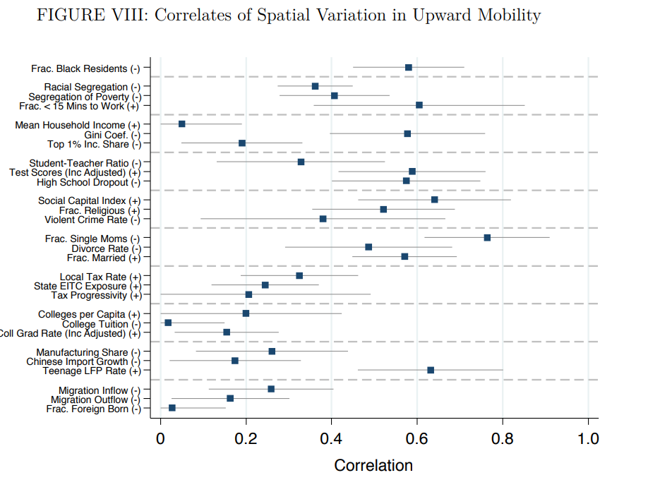

corrplot
=================================

[Overview](#overview)
| [Installation](#installation)
| [Usage](#usage)
| [Benchmarks](#benchmarks)
| [To-Do](#todo)
| [Acknowledgements](#acknowledgements)
| [License](#license)

Pretty plots of pairwise correlations in Stata

`version 0.11 17jul2019`


Overview
---------------------------------

Corrplot produces nice plots of pairwise correlations between a dependent variable of interest and a set of covariates.

For an example, consider Figure 8 from [Chetty et al. 2014, "Where is the Land of Opportunity? Intergenerational Mobility in the United States"](https://opportunityinsights.org/paper/land-of-opportunity/). This figure plots correlations across commuting zones (CZs) between the authors' preferred measure of intergenerational mobility and a set of commuting zone characteristics, i.e. mean household income, violent crime rate, etc.




Prequisites
---------------------------------

Corrplot requires Stata version 13 or greater.


Installation
---------------------------------

There are two options for installing corrplot.

1. The most recent version can be installed from Github with the following Stata command:

```stata
net install corrplot, from(https://raw.githubusercontent.com/mdroste/stata-corrplot/master/) replace force
```

2. A ZIP containing corrplot.ado and corrplot.sthlp can be downloaded from Github and manually placed on the user's adopath.


Usage
---------------------------------

Corrplot is really easy to use.

Here is a basic example using the 'auto' dataset of car characteristics.

```stata
* Load built-in dataset of car chracteristics
clear all
sysuse auto

* Plot the correlations between price and (mpg, trunk, weight, turn)
corrplot price mpg trunk weight turn
```

Internal documentation can be found within Stata:
```stata
help corrplot
```


Usage notes
---------------------------------

- This program returns normal asymptotic standard errors by normalizing all variables to have unit standard deviation. In finite samples, when the true correlation coefficient is near -1 or 1, this is known to behave badly. Using the option 
  
Todo
---------------------------------

Still working on this.


Acknowledgements
---------------------------------

This program automates code that was used by Raj Chetty's awesome pre-doctoral fellows, now based at [Opportunity Insights](http://www.opportunityinsights.org), in 2016.


License
---------------------------------

corrplot is [MIT-licensed](https://github.com/mdroste/stata-corrplot/blob/master/LICENSE).
